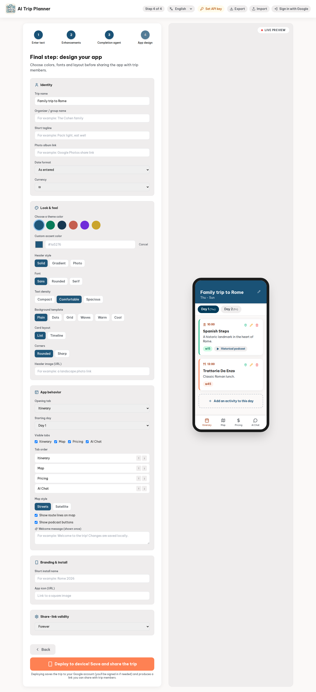
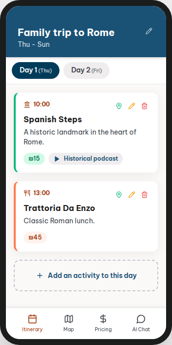
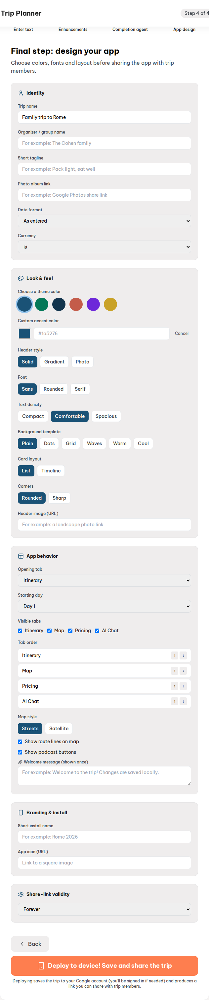
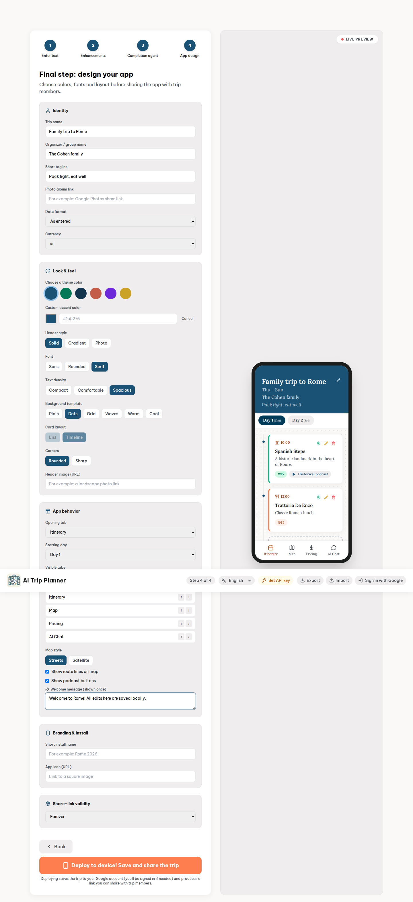
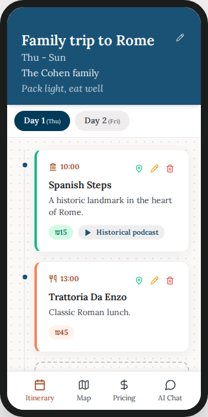
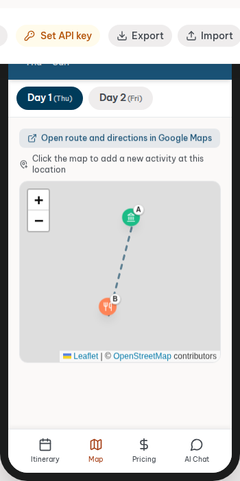

# AppMyTrip

An app that turns a free-text trip summary (e.g. pasted WhatsApp messages) into a
structured, per-day trip app — with day tabs, a map of points of interest, an AI
completion agent, and rich media (historical podcasts). Web first, Android later.

This repository currently contains an early **TripWeaver AI** prototype: a FastAPI
backend that uses an LLM to parse trip text and a React web UI that walks the user
through a 4-step build flow with a live phone preview.

## Screenshots

Step 4 — **App design** (English UI). The builder panel on the left updates the live
phone preview on the right as you change theme, fonts, background templates, tab
order, and other options.

| Overview | Live preview (default) |
| --- | --- |
|  |  |

**Design panel** — identity, look & feel, behavior, branding, and deploy:



**Customized trip** — organizer name, tagline, serif font, spacious density, timeline
layout, dots background template, and welcome message:

| Builder with options applied | Phone preview |
| --- | --- |
|  |  |

**Map tab** in the live preview (markers, route lines, day stops):



To regenerate these images locally:

```bash
cd frontend
npm run dev -- --port 5174 --strictPort   # in another terminal
SCREENSHOT_BASE_URL=http://localhost:5174 npx playwright test e2e/screenshots.spec.ts
```

## Structure

```
AppMyTrip/
├── backend/          FastAPI service (LLM parse, AI agent, TTS podcasts) — stateless
│   ├── trip_api_backend.py     entrypoint: app creation, CORS, static mount, routers
│   ├── api/index.py            Vercel serverless entrypoint (re-exports the ASGI app)
│   ├── vercel.json             Vercel Python runtime config
│   ├── models.py                Pydantic request/response models (Activity, TripData, ...)
│   ├── services/                llm.py (multi-provider), tts.py (Piper/mock TTS)
│   ├── routers/                builder.py (/api/trip/*)
│   ├── test_trip_api.py        offline tests (LLM mocked)
│   ├── requirements.txt
│   └── requirements-dev.txt
├── frontend/         Vite + React + TypeScript + Tailwind prototype
│   ├── src/App.tsx             4-step builder UI + live preview
│   ├── src/firebase.ts         Firebase init (Google sign-in + Firestore)
│   ├── src/services/tripsStore.ts   save/load/share trips in Firestore
│   ├── firestore.rules         Firestore security rules (per-user + public shares)
│   └── e2e/                    Playwright end-to-end tests (real browser, backend mocked)
├── docs/             design documentation
│   ├── hld/hld.md              High-Level Design (architecture + flows)
│   └── lld/lld.md              Low-Level Design (modules, classes, contracts)
├── .run/             shared PyCharm/WebStorm run configurations
└── main.py           (legacy scaffold placeholder)
```

## Backend

With [`uv`](https://docs.astral.sh/uv/) (fast, free, no network cost beyond the
one-time install — recommended):

```bash
cd backend
uv sync --group dev    # creates .venv/ and installs from uv.lock

uv run pytest                # run tests (no API key / network needed — LLM calls are mocked)
uv run ruff check . && uv run ruff format .   # lint / format

uv run python trip_api_backend.py   # serves on http://0.0.0.0:8000, docs at /docs
```

Or with plain `pip`:

```bash
cd backend
python3 -m venv .venv && source .venv/bin/activate
pip install -r requirements-dev.txt

# run tests (no API key / network needed — LLM calls are mocked)
pytest

# lint / format (ruff)
ruff check .
ruff format .

# run the API — no LLM API key needed to start the server itself; see
# "LLM provider" below for how keys are supplied
python trip_api_backend.py    # serves on http://0.0.0.0:8000, docs at /docs
```

The backend is fully stateless — no database, no auth, no server-side persistence:
- `POST /api/trip/parse` — raw text (+ optional `preferences`, `api_key`, `provider`) →
  structured itinerary (LLM); always returns `initial_agent_message: null` (the
  frontend shows a default greeting)
- `POST /api/trip/enhance` — current itinerary + opt-in `options` (+ `api_key`,
  `provider`) → itinerary with selected extras filled in (directions, prices,
  podcast briefs, links) — one concurrent LLM call per checked option
- `POST /api/trip/agent` — chat + current itinerary (+ optional `preferences`, `api_key`,
  `provider`) → updated itinerary (LLM)
- `POST /api/trip/generate-media` — fill TTS podcast URLs for flagged sites

`preferences` (e.g. "Vegan", "gluten-free", "חלבי") is a plain free-text field the frontend sends
with each request — there is no hardcoded dietary assumption, no special-cased
logic (e.g. no `is_kosher` field), and no per-account storage on the backend.
Saving/loading/sharing trips, and remembering a preferences string between sessions,
is handled entirely client-side via Firestore (see "Frontend" → "Trip storage"
below) — no database for us to run or back up.

### LLM provider — bring your own key

Each user supplies their **own** LLM API key from the frontend's "הגדרת מפתח API"
(API key) menu in the navbar — it's stored only in that browser's `localStorage`
and sent as `api_key` (+ which provider it belongs to, as `provider`) with every
`/api/trip/parse`/`/api/trip/agent` request. This means each user burns their own
quota/cost instead of sharing the app operator's key, and the app works without the
operator ever configuring an LLM key at all. If a request omits `api_key`, the
backend falls back to its own env vars (handy for local dev) and returns
`401 Unauthorized` if neither is set.

`backend/services/llm.py` supports four providers, selected per-request via
`provider` (or the server-side `LLM_PROVIDER` env var as a fallback, default
`gemini`):

- `gemini` — Google Gemini. Server fallback key: `GEMINI_API_KEY` (free tier at
  [ai.google.dev](https://ai.google.dev/)).
- `openai` — OpenAI GPT models. Server fallback key: `OPENAI_API_KEY` (get one at
  [platform.openai.com/api-keys](https://platform.openai.com/api-keys)).
- `anthropic` — Anthropic Claude models. Server fallback key: `ANTHROPIC_API_KEY`
  (get one at
  [console.anthropic.com/settings/keys](https://console.anthropic.com/settings/keys)).
- `groq` — Groq's free, OpenAI-compatible API. Server fallback key: `GROQ_API_KEY`
  (get one free at [console.groq.com/keys](https://console.groq.com/keys)).

Each provider's default model can be overridden with `GEMINI_MODEL`/`OPENAI_MODEL`/
`ANTHROPIC_MODEL`/`GROQ_MODEL` env vars.

`/generate-media` doesn't call the LLM at all, so it works without any key set.

### Text-to-speech provider

`backend/services/tts.py` selects a provider via the `TTS_PROVIDER` env var:

- `mock` (default) — instant fake URLs, no network, no cost. Used in dev/test/CI.
- `piper` — synthesizes real audio locally with the open-source
  [Piper](https://github.com/rhasspy/piper) engine (`piper-tts` package, already in
  `requirements.txt`). Fully offline, no API key, no per-request cost. Requires a
  one-time voice model download, then:
  ```bash
  export TTS_PROVIDER=piper
  export PIPER_VOICE_MODEL=/path/to/en_US-amy-medium.onnx
  ```
  Generated `.wav` files are written to `backend/static/podcasts/` and served at
  `/static/podcasts/<file>.wav`.

## Frontend

```bash
cd frontend
npm install
npm run dev           # dev server
npm run build         # type-check + production build into dist/
npm run preview       # serve the production build

# lint / format (eslint + prettier)
npm run lint
npm run format
npm run format:check

# run tests (vitest + React Testing Library)
npm run test

# end-to-end tests (Playwright — real browser, real dev server, backend mocked)
npx playwright install chromium   # one-time browser download
npm run test:e2e
```

### Trip storage (save / load / share trips)

Each user signs in with their own Google account and saves trips as documents in
Firestore, under `users/{uid}/trips/{tripId}` — readable/writable only by that user
(see `frontend/firestore.rules`). Sharing a trip copies it into a top-level
`sharedTrips/{tripId}` doc that anyone can read (no sign-in required) but only the
owner can write, and produces a `?shared=<tripId>` link; opening that link loads the
trip read-only-by-link into the builder. Firestore on the free **Spark** plan covers
this with normal usage — no billing account required.

When sharing, the user picks a link lifetime (7 / 30 / 90 days, or "forever" — the
default). A chosen duration is stored as an `expiresAt` timestamp on the
`sharedTrips` doc; `loadSharedTrip` rejects the link client-side once that time has
passed, even before Firestore physically deletes the document. For actual automatic
deletion of expired share docs (so they don't sit around forever just unreadable),
configure a free, built-in **Firestore TTL policy** on the `sharedTrips.expiresAt`
field — Firebase console → Firestore Database → TTL tab → add a policy for that
field/collection (or `gcloud firestore fields ttl-policies update`). This is a
one-time infrastructure setting, not app code; it's included on the Spark plan (no
billing upgrade, no Cloud Functions needed), though deletion can lag up to ~24h
after `expiresAt` — the client-side check above covers that gap. Deleting a private
trip (the "My Trips" list's ✕ button) also deletes its `sharedTrips` copy, so the
share link stops working immediately rather than relying on TTL cleanup.

Setup (free, no billing required):
1. Create a project at the [Firebase console](https://console.firebase.google.com/).
2. **Build → Authentication → Sign-in method** → enable the **Google** provider.
3. **Build → Firestore Database** → create a database (production mode is fine —
   rules are set explicitly below).
4. **Firestore Database → Rules** → paste in the contents of `frontend/firestore.rules`
   and publish.
5. **Project settings → General → Your apps** → add a Web app, copy the config values.
6. Copy `frontend/.env.example` to `.env.local` and fill in:
   ```bash
   VITE_FIREBASE_API_KEY=...
   VITE_FIREBASE_AUTH_DOMAIN=your-project.firebaseapp.com
   VITE_FIREBASE_PROJECT_ID=your-project
   VITE_FIREBASE_APP_ID=...
   ```
7. In **Authentication → Settings → Authorized domains**, add `localhost` (already
   there by default) and your Vercel domain once deployed.

In the app, the cloud icon in the top-right of the navbar lets a user sign in, save
the current trip, browse/load previously saved trips, and share/delete them.

## Deploying

- **Frontend → Vercel** (free Hobby tier): import the repo, set the root directory to
  `frontend/`, build command `npm run build`, output directory `dist`. Add the
  `VITE_FIREBASE_*` and `VITE_API_URL` env vars from above in the Vercel project
  settings. A `frontend/vercel.json` is included so SPA routes don't 404 on refresh.
- **Backend → Vercel serverless functions** (free Hobby tier, no billing account):
  import the repo as a *second* Vercel project, set the root directory to `backend/`.
  `backend/vercel.json` + `backend/api/index.py` expose the FastAPI app as a Python
  serverless function; `requirements.txt` is installed automatically. Add the
  `CORS_ORIGINS` (your frontend's Vercel domain) env var in the Vercel project
  settings. Since each user supplies their own LLM API key from the frontend (see
  "LLM provider — bring your own key" above), you don't need to set
  `GEMINI_API_KEY`/`OPENAI_API_KEY`/`ANTHROPIC_API_KEY`/`GROQ_API_KEY` for a deployed
  instance — they're only useful as a local-dev fallback. Leave `TTS_PROVIDER` unset
  (defaults to `mock`) — Vercel's
  functions have an ephemeral, mostly read-only filesystem, so the local Piper engine
  (which needs a writable, persistent voice-model + audio directory) isn't a fit here.
  Alternatively, deploy the same FastAPI app as a long-lived process on a free-tier
  Render/Fly.io instance if you want real Piper TTS.
- **Auth/Firestore → Firebase**: no separate deploy step — Firebase Authentication and
  Firestore are managed services; you only need the project + Web app config and the
  security rules from the setup steps above.

## How they connect

The frontend calls the backend through `frontend/src/api.ts`. The base URL is set
by `VITE_API_URL` (see `frontend/.env.example`, default `http://localhost:8000`).

- Step 1 "create app structure" → `POST /api/trip/parse`
- Step 2 opt-in enhancements → `POST /api/trip/enhance`
- Step 3 agent chat → `POST /api/trip/agent`
- Step 3 → 4 "continue to design" → `POST /api/trip/generate-media`

Activities added later in Step 3 (via the chat agent or the live preview's "+"
button) automatically re-run the Step 2 enhancements the user checked, so new
stops get the same directions/prices/podcast-briefs/links without revisiting
Step 2.

If the backend is unreachable (or the `parse`/`agent` calls fail because no API key
is configured — either via the frontend's API key menu or a server-side env var),
the UI shows a notice and falls back to local mock behaviour so the prototype stays
demoable. The backend enables CORS (configurable via the `CORS_ORIGINS` env var,
default `*`) so the browser can reach it.

To run the full stack: start the backend (`python trip_api_backend.py`), then the
frontend (`npm run dev`), and set your own LLM API key via the navbar's "הגדרת מפתח
API" menu (or set e.g. `GEMINI_API_KEY` server-side for local dev).

## IDE run configurations

`.run/` contains shared PyCharm/WebStorm run configurations (the VCS-friendly
alternative to per-user `.idea/` files, which stay gitignored):
- **Backend (FastAPI)** — runs `trip_api_backend.py`
- **Backend tests (pytest)** — runs the backend test suite
- **Frontend (npm dev)** — runs the Vite dev server

They assume a `backend/.venv` (e.g. created by `uv sync --group dev`) and a
frontend Node interpreter configured in the IDE's Node settings.

## Notes

- Design docs: [`docs/hld/hld.md`](docs/hld/hld.md) (architecture) and
  [`docs/lld/lld.md`](docs/lld/lld.md) (module-level detail).
- The `parse` and `agent` endpoints need an LLM key — Gemini by default, or Groq (see
  "LLM provider" above). `generate-media` defaults to a mock TTS service (see
  "Text-to-speech provider" above for the free local Piper option).
- Dietary/other preferences are entered as free text in the builder UI and sent with
  each request — not a hardcoded assumption, not stored server-side (see
  "Backend" above and "Trip storage" under "Frontend").
- Everything in this app is free to run, with no billing account anywhere: Gemini's
  free tier, local Piper TTS (or mock TTS on serverless), Vercel's Hobby tier for both
  frontend and backend, and Firebase's Spark plan for auth + Firestore.
