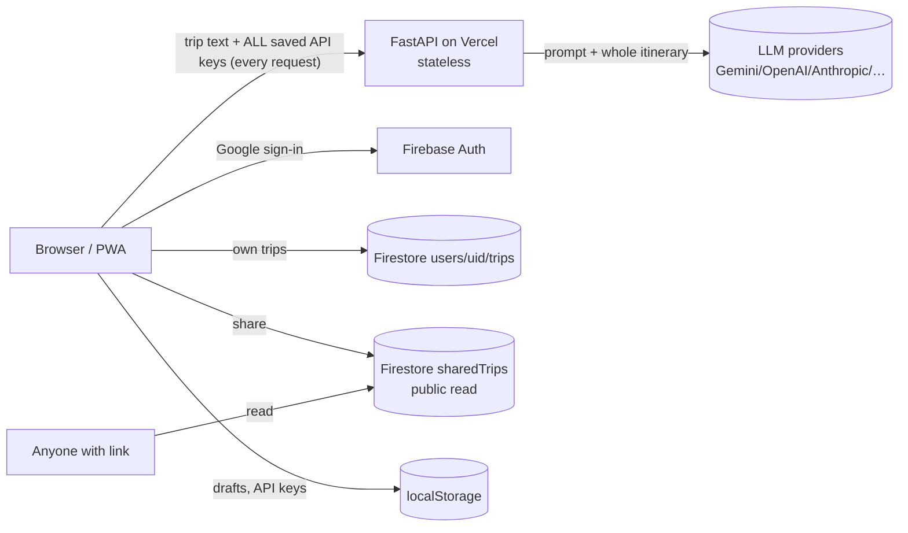

# AppMyTrip audit: AI skills and roles, security, scale, UX, mobile

**Date:** 2026-10-06. **Commit audited:** `baf703c` (main). **ogen-ai submodule:** `00d0ed1`.
**Scope:** every skill, command and role agent in the `.ai` (ogen-ai) submodule, plus the
app itself: security, data storage, data flow, scale under heavy traffic, testing, UX/GUI,
features, bugs, and what it would take to ship it as an Android/iPhone app.

Every finding below cites a file and line I opened or a command I ran. Severity uses the
same scale as `.ai/skills/role_review/SKILL.md`: **critical**, then high, medium, low, info.

## What I ran

| Check | Result |
|---|---|
| Backend `pytest --cov` | 106 passed, 2 skipped, **84 %** line coverage (`services/llm_model_dispatcher.py` 0 %, because the optional dependency is not installed) |
| Frontend `vitest run` | 49 files, **365 passed** |
| `tsc --noEmit`, `eslint .` | clean, but only because `strict` is off (see FE-01) |
| `tsc --noEmit --strict --noUncheckedIndexedAccess` | **87 errors** |
| `mypy --strict` on backend source | **24 errors** in 5 files (mypy is not run in CI) |
| `npm audit` | 15 vulnerabilities (12 high), mostly build-time (tailwind, workbox), plus `firebase` → `@grpc/grpc-js` |
| `.ai/skills/audit_repo/run_audit.py` | overall 66.8/100. Security 100 and Testing 100 with **0 findings**, which is wrong (see SK-05) |
| `.ai/skills/repo_tree/gen_tree.py --check` | trees current |
| ogen-ai's own `python -m unittest` (run from `.ai/`) | 132/133. `test_structure_doc` fails when the repo is mounted as `.ai` (see SK-04) |
| `python .ai/bin/ai-sync --dry-run` | would create `.claude/skills` and `.claude/commands`, which **do not exist today** (see SK-01) |

---

## Part 1: AI skills and role agents

### Inventory and verdict

| Unit | Kind | What it does | Verdict for this repo |
|---|---|---|---|
| `architect` | role | coupling, boundaries, HLD/LLD checklist | **Keep.** Useful here: `App.tsx` and `llm.py` are god files |
| `ciso` | role (no Bash) | secrets, injection, authz, supply chain | **Keep, update.** It never looks at Firebase/Firestore rules, which is where this app's worst bug is (SEC-01) |
| `sre` | role | health, timeouts, observability, rollback | **Keep, update.** Its deploy glob omits `vercel.json`/`firebase.json`, so here it would report "no deployment surface" (SK-06) |
| `qa` | role | test quality, isolation, missing paths | **Keep** |
| `senior-dev` | role | line-level correctness | **Keep** |
| `product` | role | docs-vs-behavior, public surface, error copy | **Keep, update.** It may not start a server, so it never sees the GUI (SK-07) |
| `engineering-manager` | role | CI gates, bus factor, deps | **Keep.** Cheap and accurate. It would flag the advisory-only audits in CI |
| `planner` | role (no Bash) | dedupe 7 reports into one backlog | **Keep** |
| `developer` | role (edits) | implements approved backlog items only | **Keep.** The human-approval gate is the best part of the design |
| `docs-sync` | role (edits) | docs and Confluence drift | **Update.** Its MCP tool names don't match the connected server (SK-03) |
| `tracker` | role (no Bash) | backlog → Jira | **Update.** Same alias problem (SK-03) |
| `audit-repo` | skill and script | 6-domain scored scan | **Update.** Scores this repo 100 on Security and Testing (SK-05) |
| `role-review` | skill | shared schema, severity, budget | **Keep** |
| `repo-tree` | skill and script | generated STRUCTURE.md, drift check | **Keep.** Already wired into CI (`.github/workflows/docs.yml`) |
| `write-design-doc` | skill | HLD/LLD writer | **Keep** |
| `conventional-commit` | skill | commit message from diff | **Keep.** History follows it |
| `customize-config` | skill | `ai-project-config.toml` weights | **Keep, use it.** Weight Security 1.5 here, since the app handles user API keys and emails |
| `release-checklist` | skill | version bump and tag | **Keep in ogen-ai, idle here.** No tags or CHANGELOG exist; adopt it when you start versioning the mobile builds |
| `port-module-to-ts` | skill | JS/Py → TS port | **Drop from this repo's manifest.** Nothing to port |
| `scaffold-python-service` | skill | new FastAPI skeleton | **Drop from this repo's manifest.** Backend already exists |
| `/review`, `/test` | commands | diff review, test writing | **Keep** |
| `/role-review`, `/role`, `/role-backlog`, `/role-implement` | commands | the role workflow | **Keep, but install them** (SK-01) |
| `/sync-tracker`, `/sync-docs` | commands | Jira/Confluence | **Keep after SK-03 is fixed** |
| `/docs-bootstrap` | command | create HLD/LLD/STRUCTURE | **Idle here.** The doc set already exists |

### Strengths

- **Enforcement comes from tool grants, not prompts.** `ciso`, `planner` and `tracker` get no
  Bash, and only `developer` and `docs-sync` can edit files. `.ai/tests/test_conventions.py`
  pins this matrix.
- **Humans approve before code changes.** `/role-implement` refuses an empty item list, a
  stale backlog or a dirty worktree (`.ai/commands/claude/role-implement.md`, steps 2–4).
- **Lanes are explicit.** Every role says what it does *not* own, and the planner's dedupe
  rules (`SEC`/`SRE` on secrets, `SDR`/`QA` on bug-plus-test) are concrete.
- **Evidence rules:** every finding needs a real `file:line`, with a 15-finding cap and a read budget.
- **Reports are archived per commit** by `run_manifest.py`, so old reports aren't silently overwritten.

### Weaknesses and bugs

**SK-01 (high). The skills and roles are not installed in AppMyTrip.** `.gitignore` excludes
`.claude/skills/` and `.claude/commands/`. `ai-config.toml` never sets
`claude_agents = true`, so `.claude/agents/` is never generated. Nothing in the repo runs
`ai-sync` after a clone. In practice, **no role or skill is available in any fresh session,
including cloud/web sessions**. I confirmed this in the session that wrote this audit: none of
them was offered. Fix: either commit the generated `.claude/` trees, which CI and
cloud sessions need anyway, or add a SessionStart hook that runs
`git submodule update --init .ai && python .ai/bin/ai-sync`. Then add
`claude_agents = true`.

**SK-02 (medium). The repo contradicts itself about ogen-ai's visibility and about what's
committed.** `ai-config.toml:19` and `.github/workflows/ci.yml:24` say ogen-ai is *private*.
`.github/workflows/docs.yml:22` and ogen-ai's own `CLAUDE.md` say it is *public*. `ci.yml:26`
also says "AGENTS.md and the skill trees are real committed files", but `.gitignore` excludes
the skill trees. Pick the true statement and fix the other three.

**SK-03 (high, for the Jira/Confluence workflow). `tracker` and `docs-sync` can't reach
Atlassian.** Their `tools:` lists grant `mcp__atlassian__*`
(`.ai/agents/claude/tracker.md:4`, `docs-sync.md:4`). The connected Atlassian server in this
environment exposes its tools as `mcp__Atlassian_Rovo__*`, so both roles start with zero
usable Atlassian tools. The README admits the alias is project-specific, but it lives in a
shared file that a project can't override without editing `.ai/`, which the README forbids.
Fix in ogen-ai: let `ai-config.toml` set the alias (for example
`[options] atlassian_mcp_alias = "Atlassian_Rovo"`) and have `ai-sync` rewrite the tool names
when it copies the agents.

**SK-04 (low). ogen-ai's test suite fails in every consuming repo.**
`tests/test_structure_doc.py:53` regenerates the README tree and compares it. The root line
is the directory name, so the test expects `ogen-ai/` but gets `.ai/` when mounted as a
submodule. Fix: pin the root label (for example `--root-name ogen-ai` stamped into the marker).

**SK-05 (high, as a process risk). `audit_repo` gives false confidence on this repo.** It
scored Security **100** and Testing **100** with zero findings. The real security issues
(SEC-01 through SEC-04) live in `firestore.rules`, `vercel.json` and a logging call, and the
scanner reads none of those. Testing is 100 without ever reading a coverage report. Other
false signals:
- It counts test files as god files and scalability hotspots (`test_trip_api.py`, 9 of 12
  Scalability findings).
- It reports a "likely circular import" between `test_llm_model_dispatcher.py` and the module
  it tests.
- It says "nests loops 2 deep, likely O(n^3)", an off-by-one in the wording.

Fixes in ogen-ai:
- Exclude tests from the Architecture and Scalability domains.
- Cap a domain at about 80 when it has no findings *and* low coverage of the relevant file types.
- Add Firebase/Supabase rules files, `vercel.json`/`netlify.toml` headers and CORS config to
  the Security scan.

**SK-06 (medium). The `sre` and `ciso` context strategies miss this stack.**
`.ai/agents/claude/sre.md:23` globs Docker, Terraform, k8s, Procfile and fly. It skips
`vercel.json`, `firebase.json`, `*.rules`, `netlify.toml` and `render.yaml`. `ciso` has no
step for BaaS security rules (Firestore, Supabase RLS, S3 policies), which is where
serverless apps keep their authorization logic. Add both.

**SK-07 (medium). No role looks at the product as a user sees it.** `product` is forbidden to
start a server and reviews only docs against code. This app *is* a GUI. Its most valuable
review surfaces are the 4-step builder, RTL, mobile layout and accessibility, and no role
covers them. The repo already has Playwright with `@axe-core/playwright` (`frontend/e2e/a11y.spec.ts`).

**SK-08 (low). The permissions adapter blocks normal work.**
`.ai/adapters/claude-agent-permissions.json` denies `git commit`, `git checkout` and `rm`
project-wide, so it can't coexist with ordinary development sessions. A per-agent `PreToolUse`
hook that checks the agent name would scope the fence properly.

**SK-09 (low). Two docs are maintained by hand and nothing checks them.** ogen-ai's
`docs/INVENTORY.md` breaks its own rule that "a directory map nothing verifies is a lie". So
does `docs/.structure-notes.toml:14` in this repo, which describes `rate_limit.py` as
"Per-user rate limiting". It is actually per-IP, in memory, and off by default.

**SK-10 (low). The rules in AGENTS.md don't match the code, and CI doesn't enforce them.**
- AGENTS.md says "`strict: true` is non-negotiable", but `frontend/tsconfig.json:16` has
  `"strict": false`.
- It says code passes `mypy --strict`, but mypy isn't in CI and fails with 24 errors.
- It says "one test file per source file", but the backend has one 2,006-line test file.

Agents follow AGENTS.md, so every AI-written change fights the existing code. Either relax the
rules for this project in `ai-config.local.md` or ratchet the code toward them (FE-01, BE-07).

### Roles worth adding (in ogen-ai, generic)

| New role | Why this repo needs it | Tools |
|---|---|---|
| `ux-a11y` | Runs the Playwright and axe suite, takes screenshots at phone width, checks RTL/LTR, focus order and tap targets, and reports a UX review in the shared schema | Read, Grep, Glob, Bash (only `npx playwright test`), Skill |
| `mobile` | Checks PWA manifest, offline behavior and service-worker update flow; assesses wrapper readiness (Capacitor, TWA), deep links, store-policy risk | Read, Grep, Glob, Skill |
| `privacy` | Maps PII (emails, trip text, API keys) from collection to storage, retention and deletion; checks GDPR and app-store privacy labels. `ciso` covers exploits, not data handling | Read, Grep, Glob, Skill |
| `finops` | LLM token cost per request, serverless duration billing, Firebase free-tier quotas | Read, Grep, Glob, Skill |

---

## Part 2: The app

### How data flows today

The backend holds no state. That is a good choice: it scales horizontally and needs no
database. The cost is that **every request carries the user's full key ring and the full
itinerary**, both upstream to the backend and on to the LLM.

### Security

**SEC-01 (critical). Anyone can download every shared trip, including owner and admin emails.**
`frontend/firestore.rules:34` uses `allow read`, and in Firestore `read` means `get` **and**
`list`. An unauthenticated client can run a collection query on `sharedTrips` through the
public REST API, using the Firebase web config shipped in the JS bundle. That query returns
every shared trip. Each document carries `ownerEmail` and `adminEmails`
(`frontend/src/services/tripsStore.ts:327-328`) and the full itinerary: travel dates,
lodging, often addresses. The share link's unguessable ID protects nothing, because nobody
needs the ID.
**Fix:** `allow get: if …` (no `list`). Optionally move `ownerEmail` and `adminEmails` into a
private subcollection.

**SEC-02 (high). Users' Gemini API keys are written to server logs in plain text.**
`GeminiProvider` puts the key in the URL query (`backend/services/llm.py:120`, `?key=…`). On
any non-429 HTTP error, `llm.py:479` logs `str(e)`. For an `httpx.HTTPStatusError`, that
string contains the full request URL, so it contains the key. I reproduced it:
`Client error '400 Bad Request' for url '…:generateContent?key=AIzaFAKEFAKE1234'`. On Vercel
those logs are retained and visible to anyone with project access. `_mask_key` exists, but
this call path bypasses it.
**Fix:** send the key in the `x-goog-api-key` header, which Gemini supports, and log
`_describe_http_status_error(e)` instead of `e`. Then rotate any keys that may already be in logs.

**SEC-03 (high). API keys live in plain localStorage, and the CSP only reports.**
`frontend/src/services/apiKey.ts` stores every provider's keys in `localStorage`. A single XSS
would exfiltrate all of them. The CSP that would stop that is deployed as
`Content-Security-Policy-Report-Only` (`frontend/vercel.json:12`), so it enforces nothing, and
it has no `report-uri`, so nobody sees the reports either. The headers also lack
`frame-ancestors`/`X-Frame-Options` (clickjacking) and HSTS.
**Fix:**
- Switch to an enforcing CSP and add `frame-ancestors 'none'`.
- Send only the active provider's keys per request instead of the whole ring
  (`getAllCredentials()`).
- On mobile, move keys to Keychain/Keystore (see Mobile).

**SEC-04 (medium). The share-admin rule trusts unverified emails.** `firestore.rules:40`
matches `request.auth.token.email` against `adminEmails` without checking
`request.auth.token.email_verified`. The comment says "verified sign-in email". That holds
today only because Google is the only provider. Enable email/password or GitHub sign-in later
and anyone could register an unverified address and take admin rights.
**Fix:** add `&& request.auth.token.email_verified == true`.

**SEC-05 (medium). Firestore has no schema or size validation, so it can be used as free
hosting.** `sharedTrips` `create` (line 35) checks only `ownerId == uid`. Any Google account
can write arbitrary documents up to 1 MB into a publicly readable collection, and the owner's
free quota pays for them. **Fix:** validate keys and sizes in rules, and cap shares per user.

**SEC-06 (medium). The server-key fallback makes the backend an open LLM proxy.**
`llm.py:403` falls back to `GEMINI_API_KEY` and the other provider env vars when a request
brings no key. The README says not to set them in production, but nothing enforces that. Set
one by mistake and any `curl` gets free LLM calls on your bill. The rate limiter is off by
default (`RATE_LIMIT_PER_MINUTE` unset). **Fix:** disable the fallback unless
`ENV=development`, and fail at startup if both a key and a public `CORS_ORIGINS` are set.

**SEC-07 (medium). Dependency audits are advisory only.** `npm audit` and `pip-audit` in
`ci.yml` and `security.yml` run with `continue-on-error`, and Trivy uses `exit-code: 0`. That
leaves 12 known high-severity advisories that block nothing. Most are build-time
(tailwind 3, workbox). `firebase@12.19` pulls a flagged `@grpc/grpc-js`, which the browser
bundle doesn't use, so the real exposure is low. **Fix:** run `npm audit fix` (non-breaking),
bump firebase, then make the audits blocking.

**Already good:**
- `safeUrl()` on every user and LLM URL. No `dangerouslySetInnerHTML` or `eval` anywhere.
- Pydantic max-length caps bound request cost.
- CORS fails closed.
- Gitleaks, CodeQL and Bandit run in CI.
- GitHub Actions are pinned by SHA.
- `SECURITY.md` exists.
- The Firestore rules carefully block admin privilege escalation.

### Data storage and protection

| Data | Where | Risk | Recommendation |
|---|---|---|---|
| User trips | Firestore `users/{uid}/trips` | Fine (owner-only) | Add a size limit in rules |
| Shared trips | Firestore `sharedTrips` | **Publicly listable** (SEC-01) | `get`-only, move emails out |
| Drafts, ticks, language | localStorage | Lost when the browser is cleared, and the user isn't told | Show "saved only on this device" until signed in |
| LLM API keys | localStorage, plaintext | XSS theft (SEC-03), sent on every request, logged (SEC-02) | Header auth, enforcing CSP, secure storage on mobile |
| Backups | **None** | Spark plan has no PITR or scheduled exports. One bad rules deploy or a buggy client loses everything | Move to Blaze (pay-as-you-go stays near $0 at this size) and turn on PITR plus a weekly export |
| Rules deployment | Copy-pasted into the console (comment at `firestore.rules:4`) | Deployed rules can differ from the repo | Add `firebase.json` and deploy rules from CI. Test them with the Firestore emulator (`@firebase/rules-unit-testing`) |
| Account deletion | Not implemented | Required by GDPR, by Google Play, and by Apple guideline 5.1.1(v) for any app with sign-in | Add "Delete my account and data" |

### Scale and heavy traffic

Today's shape: Vercel serverless Python, one function invocation per request, waiting up to
45 s (`LLM_REQUEST_DEADLINE_SECONDS`) on LLM providers.

**SCL-01 (high). The rate limiter does nothing on Vercel.** It is an in-memory dict per
process (`rate_limit.py:43`). Each serverless instance has its own copy, and it is off by
default. Its `_hits` keys are never evicted, which leaks memory on a long-lived host. It reads
`request.client.host`, which behind a proxy can be the proxy's address. **Fix:** Upstash
Redis or Vercel KV with a sliding window, keyed on `x-forwarded-for` or the Firebase UID.

**SCL-02 (medium). Cost grows with trip size on every chat turn.** Each `/agent` turn sends the
*whole* itinerary to the LLM, and gets the whole thing echoed back unless the day-scoped path
triggers. The repo knows this: the truncation guard in `routers/builder.py` exists because of
it. On long trips that means the most tokens and the slowest turns. **Fix:** make the scoped
JSON-patch path the default and the full echo the fallback.

**SCL-03 (medium). Each LLM call opens a new HTTP client.** `async with httpx.AsyncClient()`
runs per call (`llm.py:136`, `183`, `275`), so every call pays a new TLS handshake.
`/enhance` fans out up to 8 of these at once. **Fix:** share one module-level `AsyncClient`.

**SCL-04 (medium). Podcast generation runs one activity at a time.**
`routers/builder.py:346` awaits TTS for each activity in turn. With the default mock provider
in production, that is 0.5 s of `asyncio.sleep` per activity: a 30-podcast trip spends 15 s
doing nothing. It also returns a fake `cdn.tripweaver.ai` URL (`services/tts.py:31`) that
always 404s, and the client then falls back to browser speech. **Fix:**
- Skip `/generate-media` entirely when `TTS_PROVIDER=mock` and let the client use browser speech.
- Use `asyncio.gather` with a semaphore for real providers.

**SCL-05 (medium). Firebase free-tier quotas cap a viral share.** Spark allows 50k document
reads and 20k writes per day. One popular shared trip link burns one read per view. **Fix:**
move to Blaze with a budget alert, or cache shared trips at the edge (a Vercel function with
`s-maxage`).

**SCL-06 (low). No observability.** Logs are `logging.basicConfig` text (`llm.py:46`), with
no request ID, metrics or error tracking, so at 3 a.m. there is nothing to look at. **Fix:**
structured JSON logs carrying a request ID, plus Sentry (it has a free tier) for both the
frontend and backend.

Rough capacity: the backend scales with Vercel's concurrency limits, so in practice the
bottlenecks are the **users' own LLM quotas** (free tiers allow only a handful of requests per minute) and
**Firestore Spark quotas**, not the backend code. That's a fine place to be for a
bring-your-own-key app. The one thing that can actually hurt the owner is SEC-06.

### Backend code quality and bugs

- **BE-01 (medium). The agent may reply in Hebrew regardless of trip language.**
  `models.py:275` describes `agent_reply` as "The friendly reply from the agent **in Hebrew**".
  That description goes into the JSON schema sent to the LLM, and it contradicts the prompt's
  "match the trip's `language`". English and French trips can get Hebrew replies. Fix: drop
  "in Hebrew".
- **BE-02 (low).** The `/enhance` 422 error returns the raw Pydantic error text from the LLM
  output to the client (`llm.py`, `_enhance_one`). The text is noisy and can echo prompt content.
- **BE-03 (low).** `generate_media` returns the trip unchanged when it is empty, but
  `get_trip()` then raises `ValueError`, which surfaces as an unhandled 500 instead of a 4xx.
  This path is unreachable today, because Pydantic requires `trip_data`.
- **BE-04 (low).** `trip_api_backend.py` silently ignores a failed `/static` mount
  (`except OSError: pass`), so a misconfigured Piper deploy fails later instead of at startup.
- **BE-05 (info).** The FastAPI title is still "TripWeaver AI API". The brand is AppMyTrip.
- **BE-06 (medium).** `services/llm.py` is 1,324 lines: providers, retry and rotation,
  prompts, intent classification and enhancement all in one file. Split it into
  `providers.py`, `retry.py`, `prompts.py` and `enhance.py`.
- **BE-07 (low).** `mypy --strict` fails with 24 errors and is not run in CI. Add
  `mypy --strict` as a non-blocking step, then ratchet.

### Frontend, GUI and UX

**FE-01 (medium). TypeScript strict mode is off.** `frontend/tsconfig.json:16` sets
`"strict": false` and `"noImplicitAny": false`, which leaves 87 hidden errors. This is the
single biggest code-quality lever on the frontend. Turn it on per file or folder, starting
with `services/`.

**FE-02 (medium). `App.tsx` is a 1,057-line god component.** `TripBuilder` holds 32
`useState` calls, including parallel `isProcessing`, `isEnhancing`, `isGeneratingMedia` and
`isSendingMessage` booleans, a pattern the house rules ban in favor of a discriminated union.
Its `useEffect` at line 239 derives `maxStepReached` from `step`, deriving state in an effect,
which the React rules also ban. Fix:
- Extract `useTripBuilder()` with a `useReducer` and a `status: "idle" | "parsing" | …` union.
- Compute `maxStepReached` in the step-change handler instead of the effect.

**FE-03 (low).** `AppFrame.tsx` (685 lines), `BuilderStep4.tsx` (656) and `ItineraryList.tsx`
(601) should also be split by responsibility.

**UX observations** (from the code and e2e specs; I didn't do a hands-on usability session):
- **Requiring an API key up front costs users.** A new visitor has to go to a third-party
  console, create a key and paste it before seeing any value. The "free key" links help.
  Options, best first:
  - a free first trip on a server key with strict per-user quotas (needs SCL-01);
  - the existing "paste into ChatGPT/Gemini and paste the reply back" path
    (`PasteExternalReply`), promoted to the default for keyless users.
- **Long waits give no progress feedback.** Parse, agent and enhance calls can take up to
  45 s. Show staged progress ("reading your text…", "building day 3…") or stream partial
  results, and let users cancel (`AbortController`).
- **Saves are invisible.** Drafts are local only. Show where the trip is saved (device or
  cloud) and when.
- **Errors need recovery actions.** Add a "Retry" button next to the error and keep the user's
  chat message in the box when a 409 or 429 comes back.
- **Accessibility.** An axe e2e spec exists. Extend it to steps 2–4, the shared view and RTL,
  and make it blocking.
- **Visibility and discoverability.**
  - Shared links render generic Open Graph tags. The readable slug helps, but a small edge
    function that serves per-trip `og:title`/`og:image` would make WhatsApp previews show the
    trip name and a cover image.
  - Add a sitemap and a public landing page for SEO.
  - Add privacy-friendly analytics (Plausible, Umami) to learn where users drop off in the
    4-step funnel.

### Testing

Strengths:
- Good unit density on both sides: 106 backend tests, 365 frontend tests.
- A coverage gate at 82 %.
- Playwright e2e covering the builder flow, mobile layout, a11y and mixed-day.
- Backend tests mock only the LLM HTTP boundary.

Gaps:
- **No Firestore rules tests.** SEC-01 and SEC-04 would have been caught by
  `@firebase/rules-unit-testing` against the emulator. Add this first.
- **No frontend coverage threshold.** Vitest coverage isn't measured in CI.
- **No contract test** between `frontend/src/api.ts` types and `backend/models.py`. They are
  maintained by hand on both sides. Generate TS types from FastAPI's OpenAPI
  (`openapi-typescript`), or add a schema snapshot test.
- **The optional backend is never tested.** `test_llm_model_dispatcher.py` has 2 skipped tests
  and the module sits at 0 % coverage, because CI's coverage job doesn't install the optional
  dispatcher.
- **No load test.** A small k6 or Locust script against a staging deploy with a mock LLM would
  validate the rate limiter and the timeouts.
- **One 2,006-line backend test file.** Split it per module, as the house rules require.

### Features worth adding (ranked by value against effort)

1. Collaborative editing is already half-built (admins on shared links). Add live updates via
   `onSnapshot` so co-travellers see changes.
2. Offline trip viewing. The PWA caches the shell but not trip data, so persist the opened
   shared trip to IndexedDB. During a trip, connectivity is exactly what users lack.
3. Export to Google Calendar. `.ics` already exists (`services/icsExport.ts`); add one-click
   "Add to Google Calendar" links.
4. Cost totals per day and per trip in the trip's currency (prices exist, and `PriceSummary` exists).
5. Push reminders on mobile ("Leave for X in 30 min"). This one needs the native wrapper.

---

## Part 3: How hard is it to ship as an Android or iPhone app?

**Short answer: easy for Android, moderate for iPhone.** The app is already a PWA (manifest,
maskable icons and service worker in `frontend/vite.config.ts`). The backend is stateless
HTTP. Leaflet, speech synthesis and the share sheet all work in mobile WebViews.

| Path | Android | iPhone | Effort | Notes |
|---|---|---|---|---|
| **Installable PWA (today)** | ✅ works | ⚠️ works with limits (no install prompt; in-browser storage can be evicted, though home-screen installs are exempt) | 0 | Already shipped |
| **TWA via Bubblewrap → Play Store** | ✅ | ❌ | **1–3 days** | Needs `assetlinks.json` and a Play listing. Firebase Google sign-in works because it runs in Chrome |
| **Capacitor wrapper (recommended)** | ✅ | ✅ | **1–3 weeks** | Same React code. Changes listed below |
| React Native / Expo rewrite | ✅ | ✅ | 2–4 months | Only worth it if you need heavy native UI. Services and logic in `services/` port, but the UI does not |
| Native Kotlin and Swift | ✅ | ✅ | 4–8 months | Not justified |

**What changes for Capacitor (the realistic path):**

1. **Google sign-in.** `signInWithPopup`/`signInWithRedirect` don't work inside an iOS or
   Android WebView, because Google blocks embedded user agents. Use
   `@capacitor-firebase/authentication` for native Google sign-in, then
   `signInWithCredential`. On iOS, guideline 4.8 requires an equivalent privacy-focused
   login option, in practice **Sign in with Apple**, once Google sign-in is offered.
2. **API key storage.** Move keys from localStorage to Keychain and Keystore
   (`capacitor-secure-storage-plugin`).
3. **CORS.** Add `capacitor://localhost` (iOS) and `https://localhost` (Android) to
   `CORS_ORIGINS`.
4. **Deep links.** Make `?shared=` links open the app via Android App Links and iOS Universal
   Links (`assetlinks.json` and `apple-app-site-association` on the Vercel domain).
5. **Native share and files.** Swap `navigator.share` and the `.json`/`.pdf` downloads for
   `@capacitor/share` and `@capacitor/filesystem` (WebView downloads are unreliable on iOS).
6. **App Store review risk.**
   - Guideline 4.2 rejects apps that are "just a website". Offline trip viewing, push
     reminders and native share justify the wrapper (see Features 2 and 5).
   - Guideline 5.1.1(v) requires in-app account deletion.
   - The "bring your own API key" flow is allowed, but reviewers need a working demo
     key or demo mode.
7. **Privacy labels.** Both stores need a data-safety form covering email, trip content, and
   API keys sent to third-party LLMs. A privacy policy URL is mandatory.

Accounts: a $25 one-off Google Play fee; a $99/year Apple Developer fee and a Mac (or a CI
service such as Codemagic or Ionic Appflow) for iOS builds.

---

## Prioritized action list

| # | Sev. | Action | Area | Est. |
|---|---|---|---|---|
| 1 | critical | Change `sharedTrips` `allow read` to `allow get` and add an emulator rules test | SEC-01 | S |
| 2 | high | Send Gemini key via `x-goog-api-key` header, stop logging `str(e)`, rotate keys | SEC-02 | S |
| 3 | high | Install the AI tooling for real: commit `.claude/` trees or add a SessionStart hook; set `claude_agents = true` | SK-01 | S |
| 4 | high | Enforce CSP, add `frame-ancestors`, HSTS; send only active provider's keys | SEC-03 | M |
| 5 | high | Shared rate limiter (Upstash/KV), keyed per user; hard-disable server key fallback in prod | SCL-01, SEC-06 | M |
| 6 | high | Fix `audit_repo` blind spots (rules files, headers, test exclusion, no-findings ≠ 100) | SK-05 | M |
| 7 | high | Make `tracker`/`docs-sync` MCP alias configurable | SK-03 | S |
| 8 | medium | `email_verified` in rules; schema and size validation in rules; deploy rules from CI | SEC-04, SEC-05 | S |
| 9 | medium | Firestore backups (Blaze plus PITR or scheduled export); account deletion | Data | M |
| 10 | medium | Remove "in Hebrew" from `agent_reply` schema | BE-01 | S |
| 11 | medium | Share one `httpx.AsyncClient`; skip mock TTS; gather real TTS | SCL-03, SCL-04 | S |
| 12 | medium | Turn on TS `strict` incrementally; extract `useTripBuilder` reducer from `App.tsx` | FE-01, FE-02 | L |
| 13 | medium | Make dependency audits blocking after `npm audit fix` and a firebase bump | SEC-07 | S |
| 14 | medium | Add `ux-a11y`, `privacy`, `mobile` roles in ogen-ai; extend `sre`/`ciso` globs | SK-06, SK-07 | M |
| 15 | medium | Contract test or generated TS types from OpenAPI; frontend coverage gate | Testing | M |
| 16 | medium | Capacitor wrapper with native Google and Apple sign-in, secure key storage, deep links | Mobile | L |
| 17 | low | Fix contradicting comments on ogen-ai visibility and committed trees | SK-02 | S |
| 18 | low | Fix ogen-ai's `test_structure_doc` root-name assumption | SK-04 | S |
| 19 | low | Split `services/llm.py` and `test_trip_api.py`; add mypy to CI (non-blocking) | BE-06, BE-07 | M |
| 20 | low | Structured logs with request ID, plus Sentry | SCL-06 | S |

Items 6, 7, 14 and 18 are changes to the shared ogen-ai repo, not to this one.
