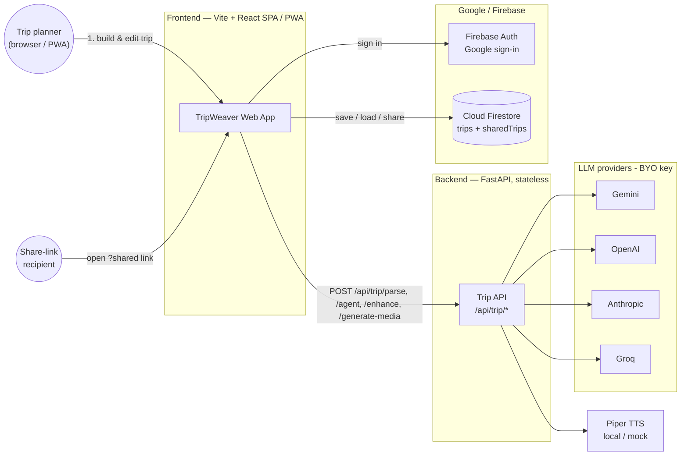
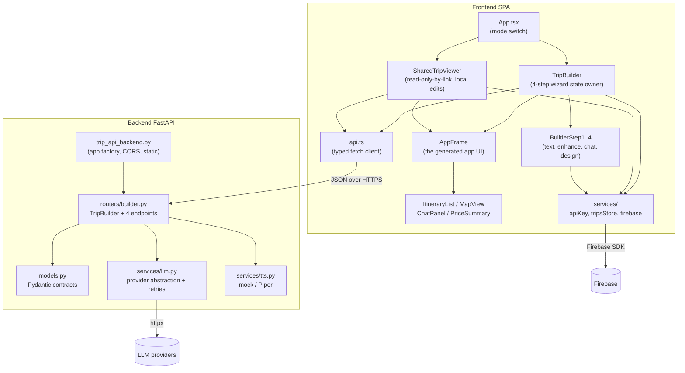
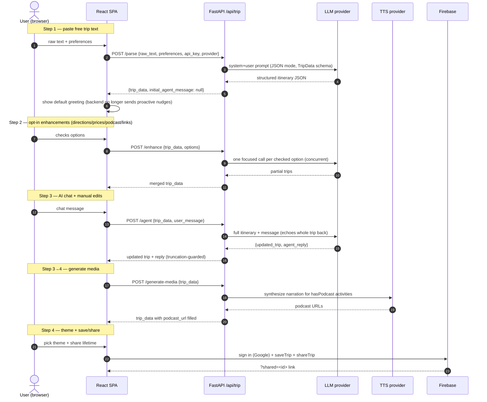
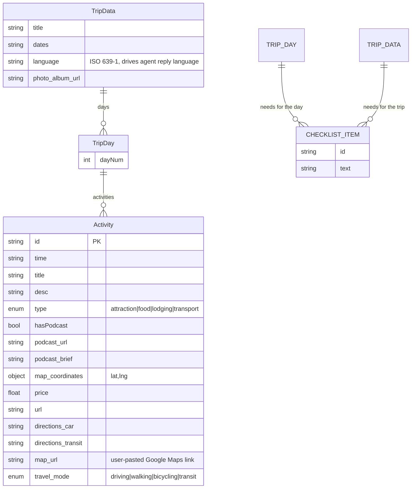
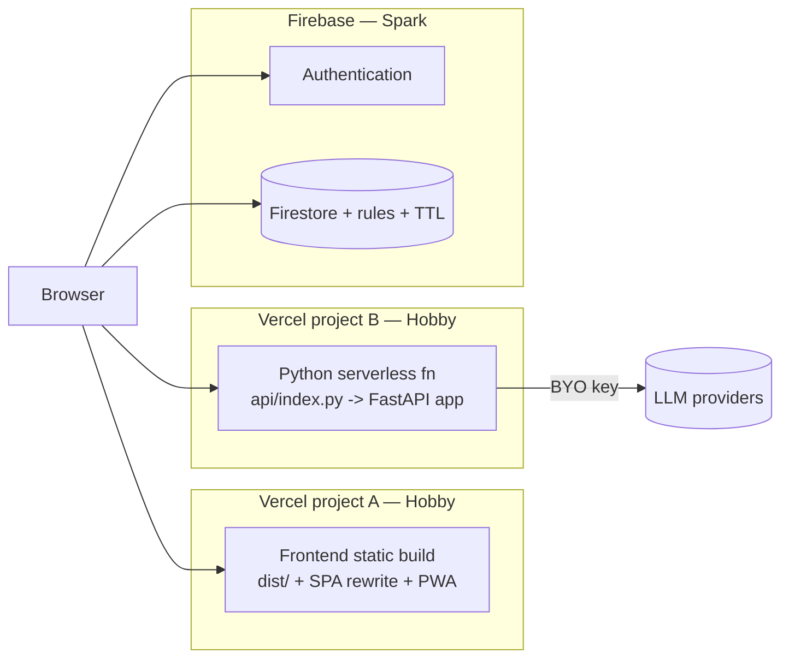

# AppMyTrip — High-Level Design (HLD)

> Scope: the current **TripWeaver AI** prototype in this repository — a FastAPI
> backend that turns free trip text into a structured itinerary via an LLM, and a
> Vite + React + TypeScript web client that walks the user through a 4-step build
> flow with a live phone preview, then saves/shares the result through Firebase.

Companion document: [`docs/lld/lld.md`](../lld/lld.md) (Low-Level Design).

---

## 1. Purpose & Product Vision

AppMyTrip turns a free-text trip summary (e.g. pasted WhatsApp messages) into a
structured, per-day trip app: day tabs, a map of points of interest, an AI
completion agent, and rich media (historical "podcasts"). Web first, Android later.

Core product goals that shape the architecture:

| Goal | Architectural consequence |
|------|---------------------------|
| **Zero running cost** | No database we operate; Firebase Spark + Vercel Hobby + free LLM tiers |
| **Bring-your-own LLM key** | Each request carries its own `api_key`/`provider`; server key is only a dev fallback |
| **Always demoable** | Client falls back to a local mock trip when the backend/LLM is unavailable |
| **Stateless backend** | Every endpoint is pure `request → LLM/TTS → response`; no session, no auth, no persistence |
| **Multilingual / RTL first** | UI is Hebrew/RTL; the LLM detects and echoes the trip's dominant language |

---

## 2. System Context

**Key point:** the browser talks to two independent back ends — our stateless
**Trip API** (LLM/TTS work) and **Firebase** (auth + storage). They never talk to
each other; the browser is the only thing that knows about both. This keeps the
Trip API free of user accounts and data, and keeps persistence on a managed free
tier.

---

## 3. Container / Component View

### 3.1 Frontend containers

| Container | Responsibility |
|-----------|----------------|
| `App.tsx` | Chooses **builder mode** vs **shared-viewer mode** from the `?shared=<id>` URL param; owns all trip state and mutation handlers |
| `BuilderStep1..4` | The wizard: (1) paste text, (2) opt-in enhancements, (3) AI chat + edit, (4) theme + save/share |
| `AppFrame` | The actual "generated app" (header, day tabs, itinerary/map/price/chat tabs, podcast player, bottom nav). Reused by the live preview and the shared page. A "manage days" panel on the day-tab bar adds/deletes/reorders whole days (move earlier/later, jump to start/end). A small "Made with AppMyTrip" attribution strip below the bottom nav links back to the builder's own origin, in the current UI language |
| `api.ts` | Typed client for the four backend endpoints; also the single source of truth for the shared `TripData`/`Activity` TypeScript types |
| `services/*` | `apiKey` (BYO key in localStorage), `tripsStore` + `firebase` (auth + Firestore), plus helpers (`hebrewDate`, `language`, `tripFile`, `env`) |

### 3.2 Backend containers

| Container | Responsibility |
|-----------|----------------|
| `trip_api_backend.py` | App factory: CORS, optional static mount for TTS audio, router registration |
| `routers/builder.py` | `TripBuilder` (a staged builder) + the four `/api/trip/*` endpoints + a truncation guard |
| `services/llm.py` | Provider-agnostic LLM access (Gemini / OpenAI / Anthropic / Groq) with JSON-mode + retry/backoff |
| `services/tts.py` | Provider-agnostic TTS (mock by default, local Piper optional) |
| `models.py` | Pydantic request/response models — the API contract |

---

## 4. End-to-End Flow (the 4-step build)

The four HTTP endpoints map 1:1 to product stages:

| Stage | UI | Endpoint | LLM? |
|-------|----|----------|------|
| 1. Parse | `BuilderStep1` | `POST /api/trip/parse` | yes |
| 2. Enhance | `BuilderStep2` | `POST /api/trip/enhance` | yes (opt-in) |
| 3. Agent chat | `BuilderStep3` / preview chat | `POST /api/trip/agent` | yes |
| 3→4. Media | "continue to design" | `POST /api/trip/generate-media` | no (TTS only) |
| 4. Save/share | `BuilderStep4` / `CloudMenu` | Firebase (no backend) | no |

---

## 5. Data Model

The whole system revolves around one document — `TripData` — carried in every
request/response and stored verbatim in Firestore. There is no relational schema.

- **`Activity.id`** is the merge key across every flow: enhancement, agent
  updates, and manual edits all reconcile activities by `id`, never by position.
- The **base fields** (`id`, `time`, `title`, `desc`, `type`, `map_coordinates`)
  come from parse/chat; the **enrichment fields** (`price`, `url`, `directions_*`,
  `hasPodcast`, `podcast_brief`, `podcast_url`) are filled only by the opt-in
  Step 2 enhancement and the media step, keeping the default parse fast.
- The TypeScript `TripData`/`Activity` interfaces in `frontend/src/api.ts` mirror
  the Pydantic models in `backend/models.py` — they are two views of one contract.
  A field added to only one side is silently dropped: Pydantic discards unknown
  keys, so every parse/agent/enhance round-trip strips it.
- **`Activity.map_url`** is a user override for when the AI's coordinates land on
  the wrong place. Pasting a Maps link both replaces the "open in Google Maps"
  target and, when the link carries coordinates, repairs `map_coordinates` — so
  the in-app pin and the day-route link get corrected too.
- **`Activity.travel_mode`** is normally unset and inferred per leg from the
  distance to the previous stop plus the activity itself
  (`frontend/src/services/travelMode.ts`); an explicit value is a user or AI
  override that always wins. It decides which navigation links a stop offers —
  Waze appears only for driving legs, since it has no walking/cycling mode.
- **Checklists** ("what we need") hang off both `TripDay` and `TripData`: per-day
  items for that day's activities, trip-wide items for documents and chargers.
  Tick state is deliberately *not* in the model — it lives in each viewer's
  localStorage, so a shared link works read-only and one person packing doesn't
  tick the box for everyone.
- **`TripDay.dayNum`** is kept as a gapless `1..N` sequence matching array order —
  day tabs, `icsExport`'s per-day calendar-date math, and the Hebrew weekday
  labels all key off it. `frontend/src/hooks/useTripEditing.ts` renumbers it after
  every add/delete/reorder of a day.

---

## 6. Key Design Decisions

### 6.1 Stateless backend, browser-owned state
The backend keeps **no** session, DB, or per-user data. The current `TripData` is
the client's state and is round-tripped on every call. Consequences: trivial
horizontal scale, safe to run as ephemeral serverless functions, and persistence
is entirely delegated to Firebase.

### 6.2 Bring-your-own LLM key (BYO)
Each user stores their own provider key in `localStorage` and sends it as
`api_key` + `provider` with each request. The server env vars
(`GEMINI_API_KEY`, …, `LLM_PROVIDER`) are only a local-dev fallback; a request
with no usable key gets `401`. This means the operator never pays for or shares an
LLM quota, and can deploy with **no** LLM key configured at all.

### 6.3 Provider abstraction (Strategy pattern)
`services/llm.py` defines an `LLMProvider` protocol and one class per provider
(Gemini's native API, an OpenAI-compatible base shared by OpenAI + Groq, and
Anthropic's Messages API). `LLMService` selects one per request and centralizes
retry/backoff and schema validation. Adding a provider = adding one class + one
registry entry. TTS uses the same shape (`TTSProvider` protocol → mock / Piper).

### 6.4 Generic free-text preferences (no special-cased dietary logic)
`preferences` is an optional plain-text field (e.g. "Vegan", "gluten-free") sent
with parse/agent requests and injected into the LLM prompt as-is. There is no
`is_kosher` field on activities and no server-side proactive nudge after parse —
the backend always returns `initial_agent_message: null`; the frontend shows a
default greeting instead.

### 6.5 Concurrent, per-option enhancement
Step 2 fires **one small LLM call per checked option**, run concurrently
(`asyncio.gather(..., return_exceptions=True)`), then merges results by activity
`id`. Rationale: checking all five options stays about as fast as checking one,
and a single failed/rate-limited option doesn't sink the others — only a total
failure raises.

### 6.6 Re-apply enhancements to newly added activities
The frontend remembers the Step 2 checkbox selections (`enhanceOptions`) and
re-runs them via `enhanceNewActivities` whenever activities are added later —
whether by the Step 3 chat agent or manually via the live preview's "+" button.
Only the new activity IDs are sent to `/enhance`, then results are merged back
by `id`.

### 6.7 Resilience guards
- **Truncation guard** (`_looks_truncated`): a chat turn that silently drops
  more than half of a ≥4-activity itinerary is rejected with `502` (the itinerary
  is left unchanged) unless the user explicitly asked to delete things. This
  defends against the LLM hitting a token limit mid-echo.
- **Retry/backoff**: `429`s honor `Retry-After`; other transient errors get
  exponential backoff (1/2/4/8/16s), surfacing a clean `429`/`502` after retries.
- **Client fallback**: any backend/LLM failure degrades to a local demo trip or
  local mock agent reply, plus a dismissible notice, so the prototype stays live.

### 6.8 Persistence & sharing model (Firebase)
Private trips live at `users/{uid}/trips/{tripId}` (owner-only). Sharing copies
the trip into a public, read-only `sharedTrips/{tripId}` doc and yields a
`?shared=<id>` link. Optional `expiresAt` + a Firestore TTL policy handle
expiry; the client also rejects expired links defensively. Deleting a private
trip also deletes its share copy.

### 6.9 Rich media without a media pipeline
TTS "podcasts" default to a **mock** provider (instant fake URL, no cost). Real
audio is optional via local **Piper** (offline, no API key), written to
`static/podcasts/` and served by the app's static mount. The browser
(`usePodcastPlayer`) further falls back to the Web Speech API if no/failed URL —
so something is always audible.

---

## 7. Deployment View

- **Frontend → Vercel** static build (`npm run build` → `dist/`), SPA rewrite via
  `vercel.json`, PWA via `vite-plugin-pwa`. Config through `VITE_*` env vars.
- **Backend → Vercel serverless** (`backend/api/index.py` re-exports the ASGI
  `app`; `backend/vercel.json` selects the Python runtime). `CORS_ORIGINS` is the
  only env var that matters in prod; no LLM key needed (BYO). TTS stays `mock`
  because serverless filesystems are read-only/ephemeral.
- **Firebase** is a managed service; only project config + published security
  rules are needed. Long-lived Piper TTS would need a Render/Fly.io host instead.

---

## 8. Cross-Cutting Concerns

| Concern | Approach |
|---------|----------|
| **Security** | No secrets on our server (BYO key); Firestore rules enforce owner-only writes + public-read shares; API keys live only in the caller's browser and are sent solely to our backend |
| **CORS** | Enabled on the backend, origins configurable via `CORS_ORIGINS` (default `*` for local dev) |
| **Error handling** | Backend maps failures to precise HTTP codes (`401` no key, `422` bad LLM schema, `429` rate-limit, `502` LLM/truncation); frontend shows localized notices and degrades gracefully |
| **i18n / RTL** | UI is Hebrew/RTL (`dir="rtl"`) by default; the LLM detects the trip's dominant language, sets `TripData.language`, and replies in it; `LanguageIndicator` surfaces it. `LanguageSwitcher` (he/en/fr) is available in the builder navbar and, since a shared-link visitor is a different person from the builder with their own preference, in `SharedAppPage` too. A first-time shared-link visitor with no stored preference gets the UI defaulted to the trip's own `language` (`setLangIfUnset`) rather than the hardcoded Hebrew fallback; an explicit choice — the builder's or a returning visitor's — is never overridden |
| **Offline / PWA** | Installable PWA (manifest + Workbox precache); backend-independent demo fallback keeps it usable offline |
| **Performance** | Default parse/chat stay lean (enrichment deferred to opt-in Step 2); enhancement calls run concurrently; async I/O end-to-end (`httpx.AsyncClient`, `asyncio.to_thread` for Piper) |
| **Observability** | Prototype-level: server errors surface as HTTP detail strings; client logs to console. No metrics/tracing yet |

---

## 9. Quality Attributes & Constraints

- **Cost:** must run at $0 — satisfied by free tiers + BYO key + mock TTS.
- **Availability:** best-effort; single stateless service, no HA requirement.
- **Scalability:** stateless + serverless → scales with provider limits, not ours.
- **Portability:** backend is a plain ASGI app (also runnable as a long-lived
  Uvicorn process); frontend is a standard Vite SPA.
- **Data privacy:** we store nothing server-side; user data lives in the user's
  own Firebase-authenticated space and browser.

---

## 10. Risks, Limitations & Future Work

| Area | Current limitation | Possible next step |
|------|--------------------|--------------------|
| LLM reliability | Whole itinerary re-echoed each chat turn (token-limit risk, mitigated by guard) | Diff-based agent updates |
| Persistence | Firestore-only; no server-side backup we control | Optional export/import already exists (`tripFile`); add server export |
| Media | Serverless can't run Piper; mock URLs there | Dedicated TTS host or a cloud TTS adapter |
| Auth scope | Google sign-in only, client-side | Additional providers if needed |
| Testing | Unit + e2e exist; no load/perf tests | Add contract tests between TS/Pydantic models |
| Android | Web-only today | Wrap PWA / native shell later |

---

## 11. References

- Low-Level Design: [`docs/lld/lld.md`](../lld/lld.md)
- Backend entrypoint: `backend/trip_api_backend.py`
- API contract: `backend/models.py`, `frontend/src/api.ts`
- Endpoints & builder: `backend/routers/builder.py`
- LLM abstraction: `backend/services/llm.py`
- TTS abstraction: `backend/services/tts.py`
- Frontend shell: `frontend/src/App.tsx`, `frontend/src/components/AppFrame.tsx`
- Storage/sharing: `frontend/src/services/tripsStore.ts`, `frontend/firestore.rules`
- Project overview: `README.md`
