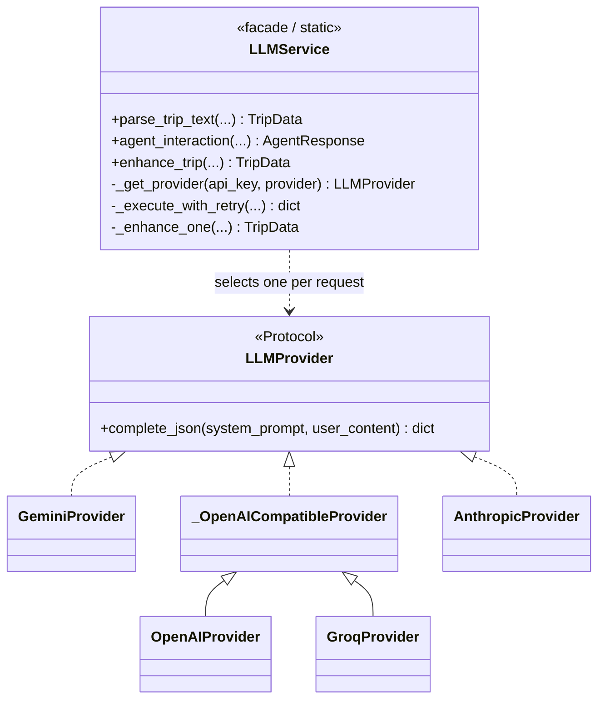
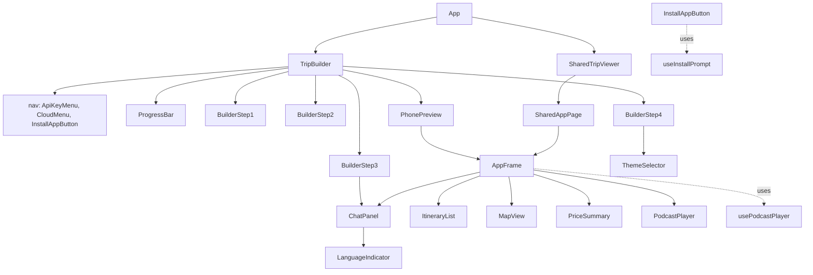
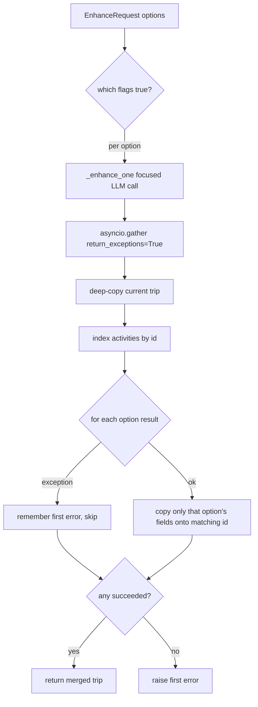
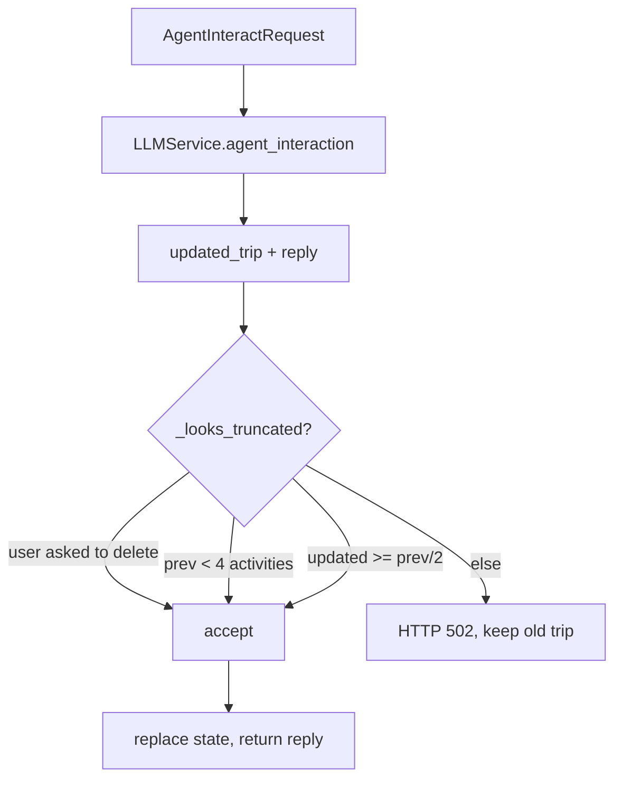

# AppMyTrip — Low-Level Design (LLD)

> Component-level design of the **TripWeaver AI** prototype: exact modules,
> classes, functions, data contracts, and control flow for both the FastAPI
> backend and the React frontend.

Parent document: [`docs/hld/hld.md`](../hld/hld.md) (High-Level Design).

---

## 1. Directory Structure

```
AppMyTrip/
├── backend/                     FastAPI service (stateless)
│   ├── trip_api_backend.py      app factory: CORS, static mount, router include
│   ├── api/index.py             Vercel serverless entrypoint (re-exports `app`)
│   ├── vercel.json              Vercel Python runtime config
│   ├── models.py                Pydantic request/response models (the contract)
│   ├── routers/
│   │   └── builder.py           TripBuilder + /api/trip/* endpoints + guards
│   ├── services/
│   │   ├── llm.py               LLM provider abstraction + retry/backoff
│   │   └── tts.py               TTS provider abstraction (mock / Piper)
│   ├── static/podcasts/         generated Piper .wav files (served at /static)
│   ├── test_trip_api.py         offline tests (LLM mocked)
│   └── requirements.txt / requirements-dev.txt / pyproject.toml
├── frontend/                    Vite + React + TS + Tailwind SPA/PWA
│   ├── src/
│   │   ├── App.tsx              mode switch + TripBuilder/SharedTripViewer state
│   │   ├── api.ts               typed backend client + shared TS types
│   │   ├── firebase.ts          Firebase init (optional)
│   │   ├── components/          UI (AppFrame, BuilderStepN, ItineraryList, ...)
│   │   ├── hooks/               usePodcastPlayer, useInstallPrompt
│   │   └── services/            apiKey, tripsStore, hebrewDate, language, ...
│   ├── firestore.rules          per-user + public-share security rules
│   ├── e2e/                     Playwright tests (backend mocked)
│   └── vite.config.ts           PWA config + build
└── docs/{hld,lld}/              this design documentation
```

---

## 2. Backend LLD

### 2.1 `trip_api_backend.py` — application factory

Responsibilities, in order:
1. Optionally load `backend/.env` via `python-dotenv` (import-guarded — absence is fine).
2. Create `FastAPI(title="TripWeaver AI API", ...)`.
3. Attempt to `mkdir` `static/podcasts/` and mount `StaticFiles` at `/static`;
   wrapped in `try/except OSError` so read-only serverless filesystems don't crash
   startup (safe there because `TTS_PROVIDER=mock` writes nothing).
4. Add `CORSMiddleware` with origins from `CORS_ORIGINS` (comma-separated, default `*`).
5. `app.include_router(builder_router)`.
6. `if __name__ == "__main__":` run Uvicorn on `0.0.0.0:8000`.

`api/index.py` simply does `from trip_api_backend import app` so `@vercel/python`
can serve the same ASGI app as a function.

### 2.2 `models.py` — API contract (Pydantic v2)

| Model | Role | Notable fields |
|-------|------|----------------|
| `Activity` | one schedule item | `id`, `time`, `title`, `desc`, `type` (`Literal["attraction","food","lodging","transport"]`), `is_kosher`, `hasPodcast`, `podcast_url`, `podcast_brief`, `map_coordinates: dict[str,float] \| None`, `price`, `url`, `directions_car`, `directions_transit` |
| `TripDay` | one day | `dayNum: int`, `activities: list[Activity]` |
| `TripData` | whole trip | `title`, `dates`, `days`, `language` (ISO 639-1, default `"he"`), `photo_album_url` |
| `ParseRequest` | Stage 1 input | `raw_text`, `preferences?`, `api_key?`, `provider?` |
| `EnhanceOptions` | Stage 2 toggles | `directions_car`, `directions_transit`, `prices`, `podcast`, `links` (all `bool=False`) |
| `EnhanceRequest` | Stage 2 input | `trip_data`, `options`, `api_key?`, `provider?` |
| `AgentInteractRequest` | Stage 3 input | `trip_data`, `user_message`, `preferences?`, `api_key?`, `provider?` |
| `AgentResponse` | Stage 3 LLM output | `updated_trip: TripData`, `agent_reply: str` |

The field descriptions double as **LLM prompt instructions** — `TripData.model_json_schema()`
is embedded in each prompt so the model returns a schema-conformant object.

### 2.3 `routers/builder.py` — endpoints + `TripBuilder`

**`TripBuilder`** is a Builder-pattern class holding one trip plus the request's
`preferences`, `api_key`, `provider`. Fluent setters return `self`. Key methods:

| Method | Purpose |
|--------|---------|
| `load_initial_text(text)` / `load_existing_trip(trip)` | seed state |
| `set_preferences / set_api_key / set_provider` | per-request config |
| `extract_with_llm()` | `await LLMService.parse_trip_text(...)` → sets `_trip` |
| `analyze_missing_requirements()` | proactive nudge: if prefs mention "kosher" and no `food` activity exists, return a Hebrew suggestion (else `None`) |
| `process_agent_update(msg)` | call agent LLM, apply truncation guard, replace `_trip`, return reply |
| `enhance(options)` | `await LLMService.enhance_trip(...)` |
| `generate_media()` | for each `hasPodcast and not podcast_url` activity, fill `podcast_url` via `TTSService` |
| `get_trip()` | return `_trip` (raises if empty) |

**Truncation guard** — module-level helpers:
- `_activity_count(trip)` = total activities.
- `_looks_truncated(previous, updated, user_message)` → `True` when the user did
  **not** use a deletion keyword (`_DELETION_KEYWORDS`, Hebrew + English), the
  previous trip had ≥4 activities, and the update dropped to `< prev/2`.
  `process_agent_update` raises `HTTPException(502)` in that case, leaving the
  itinerary unchanged.

**Endpoints** (all `POST`, all `response_model=dict`):

| Route | Builds | Returns |
|-------|--------|---------|
| `/api/trip/parse` | new builder → set config → load text → `extract_with_llm` → `analyze_missing_requirements` | `{trip_data, initial_agent_message}` |
| `/api/trip/agent` | builder from `trip_data` → `process_agent_update` | `{trip_data, agent_reply}` |
| `/api/trip/enhance` | builder from `trip_data` → `enhance(options)` | `{trip_data}` |
| `/api/trip/generate-media` | builder from `trip_data` → `generate_media` | `{trip_data, status}` |

Note `/generate-media` deliberately does **not** set `api_key`/`provider` — it
never calls the LLM, only TTS, so it works with no key configured.

### 2.4 `services/llm.py` — provider abstraction + resiliency



- **`LLMProvider`** protocol: single async method `complete_json(system_prompt, user_content) -> dict`.
- **`GeminiProvider`** — Google `generativelanguage` v1beta, `responseMimeType: application/json`; default model `gemini-2.5-flash` (`GEMINI_MODEL` override).
- **`_OpenAICompatibleProvider`** — shared base for chat-completions + `response_format: json_object`; subclasses set `url`, env key var, model env var, default model:
  - `OpenAIProvider` → `https://api.openai.com/v1/chat/completions`, default `gpt-4o-mini`.
  - `GroqProvider` → `https://api.groq.com/openai/v1/chat/completions`, default `openai/gpt-oss-120b`.
- **`AnthropicProvider`** — Messages API (no JSON mode): prompt demands bare JSON, `max_tokens=8192` (deliberately high because each agent turn re-echoes the whole itinerary), strips accidental ```` ```json ```` fences before `json.loads`.
- **`_PROVIDERS`** registry maps `"gemini"|"openai"|"anthropic"|"groq"` → class.

**`LLMService`** (all classmethods/staticmethods; no instance state):
- `_get_provider(api_key, provider)` — resolves name from `provider` arg or `LLM_PROVIDER` env (default `gemini`); unknown name → `RuntimeError`; missing key → `HTTPException(401)`.
- `_execute_with_retry(system_prompt, user_content, api_key, provider, max_retries=5)`:
  - delays `[1,2,4,8,16]`.
  - `429` → honor `Retry-After` header if present else backoff; final attempt raises `HTTPException(429)`.
  - other `httpx` / `ValueError` / `JSONDecodeError` → backoff; final attempt raises `HTTPException(502)`.
- `parse_trip_text(...)` — builds a planner system prompt (injects `preferences` if given; instructs to leave enrichment fields null; detect + set `language`), embeds `TripData` JSON schema, validates response into `TripData` (`422` on `ValidationError`).
- `agent_interaction(...)` — system prompt insists on **copying every activity through unchanged unless asked**, preserving `id` and enrichment fields, replying in `TripData.language` (or switching if the user clearly changed language), and reassigning `dayNum`/reordering `days` on structural changes; embeds `AgentResponse` schema; validates into `AgentResponse`.
- **Enhancement** (`_ENHANCE_OPTION_SPECS`): a list of `(flag_name, instruction, editable_fields)` tuples. `enhance_trip` selects the checked specs, runs `_enhance_one` per spec **concurrently** via `asyncio.gather(..., return_exceptions=True)`, then deep-copies the current trip and merges each successful result **by activity `id`, only for that option's fields**. Raises the first error only if **every** option failed.

### 2.5 `services/tts.py` — TTS abstraction

- **`TTSProvider`** protocol: `synthesize(text, slug) -> str` (returns a fetchable URL).
- **`MockTTSProvider`** (default): `asyncio.sleep(0.5)` then returns a fake CDN URL — no network, no cost.
- **`PiperTTSProvider`**: requires `PIPER_VOICE_MODEL`; runs `piper.PiperVoice` in `asyncio.to_thread`, writes `static/podcasts/<slug>.wav`, returns `/static/podcasts/<slug>.wav`.
- **`TTSService.generate_podcast_for_activity(title, desc, brief?)`**: slugifies the title (`_slugify`), picks the provider from `TTS_PROVIDER`, narrates `desc` (+ `brief` if present), returns the URL. `STATIC_DIR`/`PODCASTS_DIR` are module-level `Path`s reused by the app factory.

### 2.6 Backend error taxonomy

| HTTP | Raised by | Meaning |
|------|-----------|---------|
| `401` | `_get_provider` | no LLM key (request nor server env) |
| `422` | model validation | LLM returned schema-invalid JSON |
| `429` | `_execute_with_retry` | provider rate-limited after retries |
| `502` | `_execute_with_retry` / `process_agent_update` | LLM failed after retries, or response looked truncated |

---

## 3. Frontend LLD

### 3.1 State ownership (`App.tsx`)

`App` renders `SharedTripViewer` when the URL has `?shared=<id>`, else `TripBuilder`.

**`TripBuilder`** owns the wizard state and every mutation handler:

| State | Meaning |
|-------|---------|
| `step` (1–4) | current wizard step; mirrored into `history.pushState` so device Back navigates steps, not out of the app |
| `rawText`, `preferences`, `theme` | Step 1/4 inputs |
| `tripData` | the working trip (starts `EMPTY_TRIP`) |
| `tripId` | Firestore id once saved/loaded (`null` = unsaved → next save creates new) |
| `agentMessages` | chat transcript |
| `enhanceOptions` | remembered Step 2 toggles, re-applied to newly added activities |
| `isProcessing/isEnhancing/isGeneratingMedia/isSendingMessage` | per-call loading flags |
| `apiNotice` | dismissible localized fallback banner |

Handlers: `handleProcessText` (parse, fallback → `DEMO_TRIP`), `handleEnhance`,
`handleSendMessage` (agent, fallback → `mockAgentReply`), `handleContinueToDesign`
(generate-media), `handleUpdateActivity`, `handleAddActivity`, `handleUpdateTrip`,
and `enhanceNewActivities(before, after)` — diffs by activity `id`, re-runs the
remembered enhancements only on newly added activities, then merges by `id`.

**`SharedTripViewer`** is deliberately **local-only**: it loads the trip via
`loadSharedTrip`, keeps its own `trip`/chat state, and its handlers only call
`setTrip` — it never imports `saveTrip`/`shareTrip`, so edits stay in the browser.

### 3.2 `api.ts` — typed client

- `API_BASE_URL` = cleaned `VITE_API_URL` (default `http://localhost:8000`), trailing slashes stripped.
- Shared TS interfaces: `Activity`, `TripDay`, `TripData`, `EnhanceOptions`, and the response types — these are the frontend mirror of `backend/models.py`.
- `postJSON<T>(path, body)` — one `fetch` wrapper; throws `Error("API {path} failed ({status}): {detail}")` on non-2xx (the `(429)` substring is how the UI detects rate-limits).
- Functions: `parseTrip`, `agentInteract`, `enhanceTrip`, `generateMedia` — each maps to its endpoint and threads `apiKey`/`provider`.

### 3.3 Component composition



### 3.4 Component reference

| Component | Purpose / key props | Notable behavior |
|-----------|---------------------|------------------|
| `AppFrame` | The generated-app UI (header, day tabs, 4 content tabs, bottom nav). Props: `tripData`, `theme`, chat props, `onUpdateActivity/onAddActivity/onUpdateTrip`, `isLocalOnly` | Owns `activeDay`, `activeTab`, `focusActivityId`, header edit drafts; uses `usePodcastPlayer`; empty-state safe; theme → header color; scroll arrows when `days>4` |
| `PhonePreview` | Wraps `AppFrame` in a phone bezel for the builder's live preview | Pure presentational passthrough |
| `SharedAppPage` | Full-screen `AppFrame` for `?shared` links + import | Adds local-only notice, import via `tripFile` |
| `ItineraryList` | Renders/edits a day's activities. Props: `activities`, `onUpdateActivity`, `onAddActivity?`, `onShowOnMap?`, `playingPodcast`, `onPlayPodcast` | Inline edit/add drafts (time/title/desc/type/price/url/lat/lng); new pin defaults near an existing one; `newActivityId()` uses `crypto.randomUUID`; podcast play button when `hasPodcast` |
| `MapView` | Leaflet/OpenStreetMap map of a day's activities (react-leaflet). Props: `activities`, `focusActivityId`, `onUpdateActivity`, `onClearFocus` | `FitBounds` child auto-fits/zooms; per-type `divIcon` markers, draggable when `onUpdateActivity` set (persist coords on `dragend`); dashed `Polyline` shows stop order (not a real route); focus mode shows one pin; external **Google Maps** place/directions links (no paid tiles/API) |
| `ChatPanel` | Message list + input; reused by Step 3 and `AppFrame`'s chat tab | Exports `AgentMessage` type; typing indicator when `isSending`; shows `LanguageIndicator` |
| `BuilderStep1` | Paste text + preferences; submit → parse | "continue without reprocessing" when a trip already exists |
| `BuilderStep2` | Opt-in enhancement checkboxes → `EnhanceOptions` | Skip/back; select-all; loading state during enhance |
| `BuilderStep3` | Chat step + edit trip dates | Continue → generate media; shows language |
| `BuilderStep4` | Theme + share lifetime + deploy/save/share | Calls `getCurrentSession()`/`signInWithGoogle`, `saveTrip`, `shareTrip`; "update existing" vs "save as new copy"; copyable share link |
| `CloudMenu` | Navbar cloud icon: sign in, save, list/load/delete/share trips | Uses `tripsStore`; keeps `tripId` in sync with `TripBuilder` |
| `ApiKeyMenu` | BYO-key UI in navbar | Reads/writes `services/apiKey` per provider |
| `ApiNotice` | Dismissible fallback banner | Driven by `apiNotice` state |
| `PriceSummary` | Totals prices across the trip | Currency/number formatting |
| `PodcastPlayer` | Floating player bar | Progress + close; driven by `usePodcastPlayer` |
| `ThemeSelector` | `blue`/`green`/`dark` picker; exports `Theme` type | — |
| `ProgressBar` | 4-step progress indicator | — |
| `InstallAppButton` | PWA install prompt trigger | Uses `useInstallPrompt` |
| `LanguageIndicator` | Shows the detected trip language | Uses `services/language` |

### 3.5 Hooks

- **`usePodcastPlayer()`** → `{ playingPodcast, progress, error, togglePlay, stop }`.
  On `playingPodcast` change: if `podcast_url` exists, play via `HTMLAudioElement`
  (progress from `timeupdate`); on audio error **fall back to Web Speech**
  (`SpeechSynthesisUtterance`, waiting for `voiceschanged`, preferring a Hebrew
  voice), with a `stopped` guard against StrictMode remount/switch races and an
  estimated progress timer. `togglePlay(act)` toggles the same activity off.
- **`useInstallPrompt()`** — captures the PWA `beforeinstallprompt` event and
  exposes a trigger for `InstallAppButton`.

### 3.6 Services

| Service | Exports | Notes |
|---------|---------|-------|
| `apiKey.ts` | `getApiKey`, `getApiKeyForProvider`, `getApiProvider`, `setApiKey`, `clearApiKey`, `PROVIDERS` | Per-provider keys in `localStorage` (`tripweaver_api_keys`); migrates a legacy single-key format |
| `firebase.ts` | `firebaseApp`, `isFirebaseConfigured` | Initializes only when `VITE_FIREBASE_*` are set; else `null` (app still runs) |
| `tripsStore.ts` | `onAuthChange`, `getCurrentSession`, `signInWithGoogle`, `signOutOfGoogle`, `listTrips`, `saveTrip`, `loadTrip`, `deleteTrip`, `shareTrip`, `loadSharedTrip`, `deleteSharedTrip` | Firestore CRUD under `users/{uid}/trips` + public `sharedTrips`; `shareTrip` optional `expiresInDays`; `loadSharedTrip` rejects expired links client-side |
| `hebrewDate.ts` | `parseTripStartDate`, `hebrewWeekdayLetter` | Derives per-day Hebrew weekday letters for the day tabs |
| `language.ts` | `languageLabel(code)` | ISO 639-1 → Hebrew language name |
| `tripFile.ts` | `exportTripToFile(trip, theme)`, `importTripFromFile(file)` | JSON download/upload for client-side backup/transfer; import validates the trip shape before accepting |
| `env.ts` | `cleanEnvVar` | Trims/normalizes `import.meta.env` values |

---

## 4. Data Contracts (per endpoint)

```jsonc
// POST /api/trip/parse
// req:  { raw_text, preferences?, api_key?, provider? }
// resp: { trip_data: TripData, initial_agent_message: string | null }

// POST /api/trip/enhance
// req:  { trip_data: TripData, options: EnhanceOptions, api_key?, provider? }
// resp: { trip_data: TripData }

// POST /api/trip/agent
// req:  { trip_data: TripData, user_message, preferences?, api_key?, provider? }
// resp: { trip_data: TripData, agent_reply: string }

// POST /api/trip/generate-media
// req:  { trip_data: TripData, user_message: "" }   // user_message unused
// resp: { trip_data: TripData, status: string }
```

---

## 5. Detailed Flows

### 5.1 Enhancement merge (Step 2)



### 5.2 Agent turn with truncation guard (Step 3)



### 5.3 Client fallback (resilience)

- `parseTrip` fails → load `DEMO_TRIP` + demo agent message, still advance to Step 2.
- `agentInteract` fails → `mockAgentReply` (keyword-based local edit) + notice.
- `enhanceTrip`/`generateMedia` fail → keep current trip + notice, continue.
- Rate-limit (`(429)` in message) → distinct "provider is rate-limiting" notice.

### 5.4 Save / share (Step 4 & CloudMenu)

`getCurrentSession()` or `signInWithGoogle()` → `saveTrip(uid, trip, {theme, tripId})`
(new doc if `tripId` null / "save as copy") → `shareTrip(uid, id, trip, theme, days?)`
writes a public `sharedTrips/{id}` doc → returns `?shared=<id>` URL. Opening that
URL routes `App` into `SharedTripViewer` → `loadSharedTrip` (expiry-checked).

---

## 6. Security (Firestore rules)

```
users/{userId}/trips/{tripId}   read,write  if auth.uid == userId
sharedTrips/{tripId}            read        if true            (public)
                               create,update if auth.uid == resource.data.ownerId
                               delete       if auth.uid == resource.data.ownerId
```

Private trips are owner-only; shares are world-readable but only the owner can
publish/unpublish. API keys never touch Firestore — they live only in the
caller's `localStorage` and are sent solely to our backend.

---

## 7. Alternatives Considered

| Decision | Chosen | Alternative | Why chosen |
|----------|--------|-------------|------------|
| LLM access | Per-provider classes behind a `Protocol` + registry | One monolithic client with `if provider ==` branches | Open/closed: add a provider without touching call sites; testable via a fake provider |
| OpenAI + Groq | Share `_OpenAICompatibleProvider` base | Duplicate class per provider | Both speak the same JSON-mode chat API; DRY |
| Step 2 enhancement | One concurrent call per option, merge by id | One combined call for all options | Faster when many options; partial-failure isolation |
| Agent update shape | Echo whole itinerary back | Return a diff/patch | Simpler prompt + validation now; diff is future work (token-limit risk mitigated by guard) |
| Backend state | Fully stateless, client owns trip | Server session/DB | Free serverless deploy; no data for us to secure/back up |
| Persistence | Firebase (client-side) | Our own DB + API | $0 managed tier; offloads auth + rules |
| TTS default | Mock provider | Always real TTS | No cost/latency in dev/CI/serverless; Piper opt-in for real audio |
| Podcast playback | Audio URL with Web Speech fallback | Audio only | Guarantees audible output even with mock URLs |

---

## 8. Test Strategy

- **Backend** (`backend/test_trip_api.py`): endpoint + builder tests with the LLM
  mocked (no key/network) — covers parse/agent/enhance/generate-media, the
  truncation guard, and enhancement partial-failure merging.
- **Frontend unit** (Vitest + RTL): `api.test.ts`, `App.test.tsx`,
  `App.shared.test.tsx`, and component tests (`ApiKeyMenu`, `CloudMenu`,
  `ItineraryList`, `MapView`, `PriceSummary`, `ThemeSelector`).
- **E2E** (`frontend/e2e/`, Playwright): real browser + dev server, backend
  mocked — exercises the full 4-step flow and shared-link view.
- **Suggested addition:** a contract test asserting the TS `TripData`/`Activity`
  interfaces stay in sync with `backend/models.py` (they are hand-mirrored today).

---

## 9. File Index (quick jump)

| Concern | File |
|---------|------|
| App factory / CORS / static | `backend/trip_api_backend.py` |
| Serverless entrypoint | `backend/api/index.py` |
| API contract | `backend/models.py` |
| Endpoints + builder + guards | `backend/routers/builder.py` |
| LLM abstraction + retries | `backend/services/llm.py` |
| TTS abstraction | `backend/services/tts.py` |
| Mode switch + state | `frontend/src/App.tsx` |
| Typed API client + TS types | `frontend/src/api.ts` |
| Generated-app UI | `frontend/src/components/AppFrame.tsx` |
| Itinerary edit/add | `frontend/src/components/ItineraryList.tsx` |
| Podcast playback | `frontend/src/hooks/usePodcastPlayer.ts` |
| BYO key storage | `frontend/src/services/apiKey.ts` |
| Firestore storage/sharing | `frontend/src/services/tripsStore.ts` |
| Security rules | `frontend/firestore.rules` |
